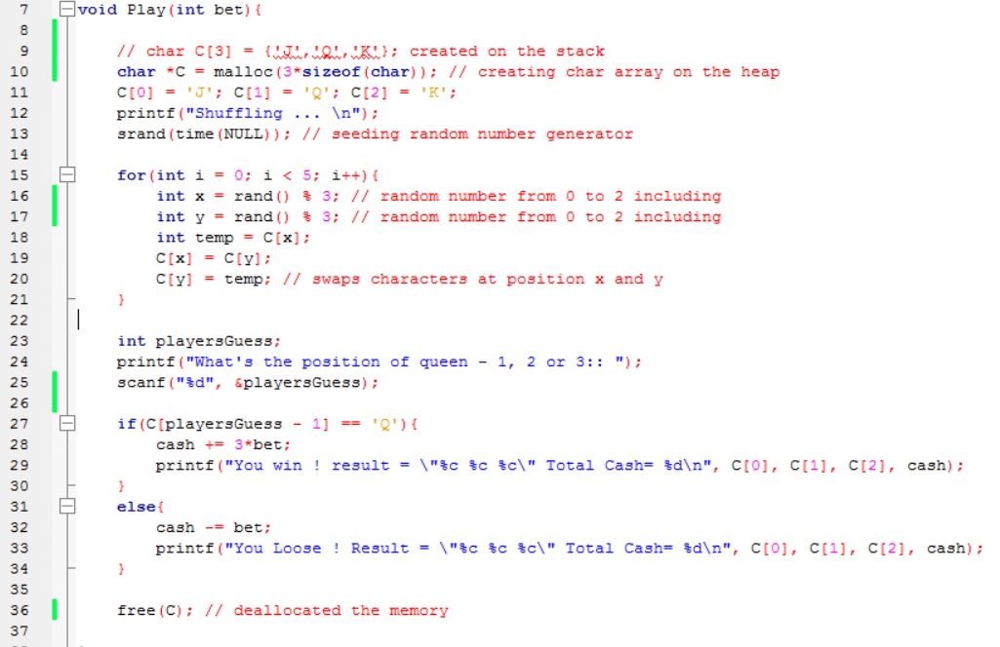
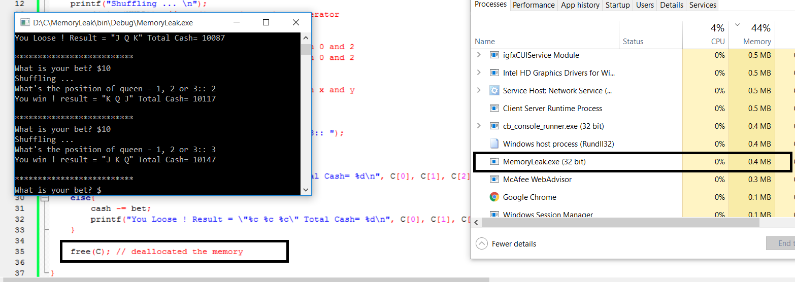
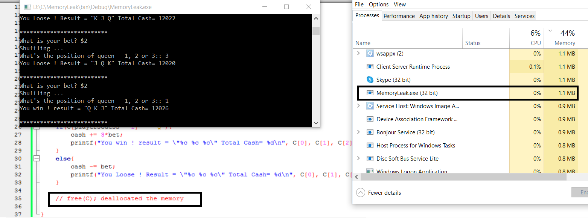

# MemoryLeak

Play() is a simple function which allocates 3 bytes on the heap which store the characters 'J', 'Q', 'K'
then shuffling the values and allows the user to guess.

At the end of the function we deallocate the memory previously allocated.
We can clearly see that after using the program for a while the RAM used for MemoryLeak.exe is 0.4MB

If we do exactly the same thing, however this time we do not deallocate the memory used.
We can see that instead of 0.4MB the MemoryLeak.exe is using 1.1MB and it will continue growing as we keep playing. 

Thus, use dynamic memory allocation carefully !
